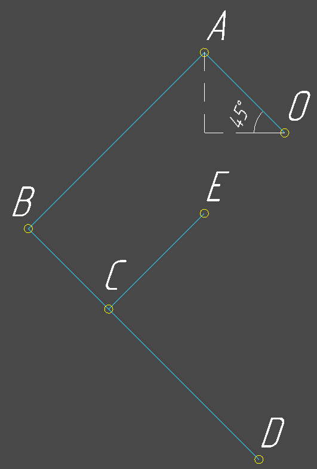

# Расчет обратной кинематики робота собаки
## Оглавление

  

### Матрица поворота в 2d пространстве имеет вид:

$$
\begin{equation}
R(\alpha) = 
    \begin{pmatrix}
        cos(\alpha) & -sin(\alpha) \\
        sin(\alpha) & sin(\alpha)
    \end{pmatrix}
\end{equation}
$$

$$
\begin{equation}
\vec{AO} = 
    \begin{pmatrix}
        x_{ao} \\
        y_{ao}
    \end{pmatrix}
\end{equation}
$$
